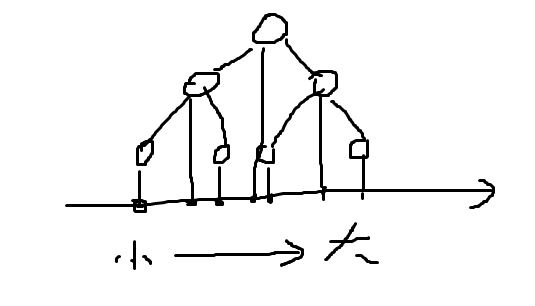
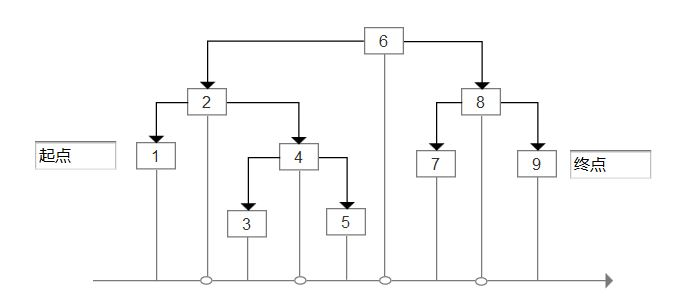

# 课文内容

## 4.1 预备知识

### 关于先中后序遍历和递归

分析先序打印目录程序和后序计算目录大小程序，可以得出，二者的递归过程是相同的，不同之处在于先序不利用return，而后序使用return。

可以得出，递归的展开过程为先序遍历，递归的计算返回过程为后序遍历。

## 4.2 二叉树

### 证明N个节点的二叉树都将需要N+1个null链

N个节点二叉树，子节点总数为2N

同时N个节点除根节点之外均有一个父节点，即已被填充的子节点为N-1

所以可以得出null链的个数为$2N-(N-1)=N+1$

### 证明N个节点二叉树的深度区间

最大值为N-1

最小值为$log{N}$

证明如下：

深度最小值即为满二叉树

$2^{h}=N$

可解得$h=log^{N}$

# 课后练习

## 4.1 说明图4-70中树的根叶节点

根节点：A

叶节点：G/H/I/L/M/K

## 4.2 说明图4-70中每个节点

父/子/兄弟/深/高

A：无/BC/无/0/4

C：A/F/B/1/2

F：C/K/无/2/1

K：F/无/无/3/0

B：A/DE/C/1/3

D：B/GH/E/2/1

E：B/IJ/D/2/2

G：D/无/H/3/0

H：D/无/G/3/0

I：E/无/J/3/0

J：E/LM/I/3/1

L：J/无/M/4/0

M：J/无/L/4/0

收获：节点的定义，注意不要漏掉兄弟节点，注意节点高度的计算。

## 4.3 图4-70中树的深度

深度为4

收获：树的深度为根节点到叶节点的最长路径

## 4.4 证明空链个数

已在课文内部4.2 二叉树中证明过

## 4.5 证明高度h的二叉树中节点最大个数

最大个数即为等比数列求和

$\sum^{h}_{i=0}{2^{i}}=2^{h+1}-1$

## 4.6证明满节点与叶节点的数量关系

假设节点为N的二叉树中满节点为x1,单节点为x2，叶节点为x3

有

$x_1+x_2+x_3=N$

$2x_3+x_2=N+1$（根据4.4题得出）

解方程得

$x_3-x_1=1$

得证满节点与叶节点个数相差1

## 4.7 证明二叉树叶节点以2为底，以负深度为指数的幂求和问题

利用归纳法证明

对于只有根节点情况，2^0=1得证

对于有1个子节点，2^-1<1得证

对于有2个子节点，2^-1+2^-1=1得证

依次递推可以发现规律

根据二叉树的自相似性质可以发现此问题的主要矛盾是单节点

即对于任意节点x，假设其深度为h

如果此节点为叶节点，则所求为2^-h

如果此节点分化出1个子节点，则所求为2^-(h+1)

如果此节点分化出2个子节点，则所求为2*2^-(h+1)=2^-h

由此可以得出结论：即当满二叉树$\sum^{M}_{i=1}2^{-d_i}=1$

对于其他情况$\sum^{M}_{i=1}2^{-d_i} < 1$

总结：主要是归纳法，自相似性，二分性，同时可以将二叉树叶节点看成是结果，而非叶节点是中间过程。

## 4.8表达式树展开前中后缀表达式

前缀表达式：$-**ab+cde$

中缀表达式：$(a*b)*(c+d)-e$

后缀表达式：$ab*cd+*e-$

## 4.9 31469257插入树和删除树

a 

b 

主要考察树的插入和删除，删除是递归的，多选择的，有2^n种情况，此题是4种。

## 4.10 目录打印和容量计算问题

已经在课文内容4.1预备知识中实现

主要考察：利用递归将目录做先序展开和后序收回计算

## 4.11 实现TreeSet，每个节点保存父节点引用。

已在代码中实现

主要重点在于：

（1）增删查时寻找节点可以采用递归和循环两种方式，递归更为简洁。

（2）实现迭代器时，从小到大遍历元素，如何使用父节点来寻找下一更大节点的问题（左—>中—>右—>跳至父树，即中序遍历表现为树的增长过程）。

## 4.12 利用组合TreeSet对象的方式，实现TreeMap

已在代码中实现

主要重点在于

（1）二者的区别，Set检索需要有原对象的副本，而Map只需要key，这导致只能由TreeSet迭代器来实现增删改查。

（2）Map需要三个迭代器方法，分别返回key/value/entry

（3）Map中的内部静态类Entry需要提供key的访问器和value的访问器和修改器

## 4.13 通过增加通向下一更小/大引用实现TreeSet

已在代码中实现

相比对4.12的实现，该方法迭代器编程要更简单，但是增删操作稍微复杂

注意点：

增删过程中头尾标记节点的更新

增删过程中nextMin和nextMax的更新

迭代器中remove方法的实现（需要寻找父节点）

## 4.14 随机增删实验

已知共aN个元素，已插入N个元素，未插入aN-N个元素

利用额外两个数组A和B分别存储已插入的N个元素和未插入的aN-N个元素

插入元素：从B数组中随机抽取，插入树中后，插入A中随机位置，时间复杂度O(N)，主要消耗在数组的元素移动上。

删除元素：从A数组中随机抽取，从树中删除后，插入B中随机位置$（random(0，aN-N)）$

抽取方法：$random(0，N)$和$random(0，aN-N)$

a的选择：这个没想出来，但是增删$N^2$次，等概率的话,，同时该采样方式属于有放回采样，平均每个元素被增删$N^2/(aN-N)=N/(a-1)$次

## 4.15 树中节点删除问题

主要考察树中度数为2节点X的删除和增删导致的树失衡问题

单删除和交替删除速度相差不大

随机删除理论上平衡性更好

## 4.16 二叉查找树的懒惰删除

需要在Node节点中增加状态域，用于表示节点是否删除

finMin和finMax，也可以不必须用递归，只需要增加一个指针，记录最后一个没有被标记为删除的值作为返回值即可。

增：如果该元素已经存在，但是被标记为删除，只需改变状态域即可，如果元素不存在域普通插入相同。

删：删除元素只需将其标记为删除即可，当标记的元素为总数据的1/2时，进行批量删除。

查：查询后需要判断该元素是否已经被标记为删除。

## 4.17 平均深度证明题

这个难了，没思路

## 4.18 AVL节点数计算

a 这个利用归纳法也没有计算出来精确表达式，有点类似斐波那契数组，但是每次的+1又与斐波那契数组不同。

（1）代入法求解

最少节点的AVL树：$h={0 ,1 ,2 ,3, 4}，N={1, 2 ,4 ,7 ,12}$

斐波那契数组：$k={0, 1, 2, 3, 4, 5, 6, 7} ：F_k={0, 1, 1, 2, 3, 5, 8, 13}$

猜测$N(h)=F(h+3)-1$

N(0)=1,F(3)=2

假设N(h)=F(h+3)-1成立

对于$N(h+1)=N(h)+N(h-1)+1=F(h+3)-1+F(h+2)-1+1=F(h+4)-1$

得证

（2）求解斐波那契数组精确解


最终得到
$$
N(h)=F(h+3)-1=\frac{(\frac{1+\sqrt{5}}{2})^{h+3}-(\frac{1-\sqrt{5}}{2})^{h+3}}{\sqrt{5}}-1
$$

已在代码中实现，并验证

b 计算得到2583

## 4.19 21459367插入AVL树结果

主要考察单双旋转问题


## 4.20 证明$2^{k}-1$从0到N插入AVL树得到的是理想平衡树

这个难了，没思路

## 4.21 AVL完成单双旋转

已实现，主要是四种情况的判断与处理，其中双旋转由两次单旋转实现。

## 4.22 AVL树节点高度检查

递归检查各节点左右子树高度差即可，注意node=null时高度为-1，这是高度计算的起点，可以保证叶节点的高度为0，从而实现各节点的高度计算。

## 4.23 AVL树非递归插入

已经在4.11的实现中实现，主要类似双链表的逻辑

（1）利用while获取节点，（2）插入节点，（3）更新高度

## 4.24 AVL树的删除

与普通树的节点删除实现相同，删除后进行平衡操作即可。

## 4.25 AVL节点空间容量计算

a 这个不会算，int类型是4*8=32bit，数据和左右链的空间不知道多少

b 8bit最多可存储高度为255的AVL树。

## 4.26 高效的双旋转

仅实现右左双旋转，左右双旋转同理。

要点：（1）直接将父节点和祖父节点与目标节点左右节点结合，变成目标节点的左右节点。

（2）高度直接计算给出。

## 4.27 伸展树查询练习

已练习

（1）四种情况可以简化为两种：之与一，特殊情况：父节点是树根的话，使用左or右单旋转

## 4.28 伸展树删除练习

已练习

（1）先访问待删除节点

（2）删除该节点

（3）再访问左子树最大值节点 （或右子树最小节点）与右子树结合（与左子树结合

## 4.29 伸展树性质证明题

a 访问最小节点会形成左子树为空，元素均在右子树的情况，依次访问就会得到一连串左儿子组成的树。

b 二星题不做

## 4.30 伸展树随机操作程序编写和性能对比

主要研究了伸展树的实现，

（1）生成随机操作序列：设置测试次数N，生成序列长度为N的随机操作（每次产生随机数字，根据随机数字选择随机操作）

（2）执行操作：对伸展树/平衡树/二叉树分别执行此序列

（3）记录：通过int值记录伸展次数，同时记录三种数据结构的耗时。

（4）分析结果

不予实现，课文中理论上已经有证明，不再进行实际测试。

## 4.31 计算二叉树中节点数量

叶节点数量为x，度数=1的节点数量为y，度=2的节点数量为z，总节点数量为N。

则有

x+y+z=N

z+1=x

2x+y=N+1

则可由先序遍历计算总结点数量N和叶节点数量x，然后可得到y和z

时间复杂度为O(N)

a 已实现，利用递归实现后序遍历以统计节点数量。

b 已实现，利用递归实现后序遍历以统计节点数量。

c 已实现，利用递归实现后序遍历以统计节点数量。

总结：后序遍历以统计信息

## 4.32 检查查找树节点是否满足有序性

在先序遍历进行节点检查


* 分几种情况讨论：
* null 返回
* 叶节点 返回
* 度数=1的节点：左<中或中<右
* 度数=2的节点：左<中<右

总结：在先序遍历进行节点检查

## 4.33 使用递归删除所有树叶

分几种情况：

假设函数签名为 Node remove(Node)

1 null 返回null

2 叶节点 返回null

3 非叶节点

  * 度数=1
    *          左节点为叶节点，右节点为null，置node.left==null，返回node
    *          右节点为叶节点，左节点为null，置node.right==null，返回node
  * 度数=2
    *          其左右节点存在且均为叶节点 node.left=node.right=null，返回node
    *          左节点为叶节点，右节点非空，node.left=null，（递归）置node.right=remove(node.right)，返回node
    *          右节点为叶节点，左节点非空，node.right=null，（递归）置node.left=remove(node.left)，返回node
    *          左右节点存在且均非叶节点 node.left=remove(node)，node.right=remove(node)，返回node

已在代码中实现

## 4.34 生成N节点随机二叉查找树

（1）初始数组：首先生成长度为N的数组，其内元素从1到N

（2）打乱顺序：令i从0增至N，交换i和j(j=random from 0 to n-1)

（3）将数组插入二叉查找树

## 4.35 生成高度=h且具有最少节点的AVL树

已在代码中实现

使用递归/分治/中序遍历解决

前提：

设节点数量为S

（1）具有最少节点的AVL树S(h)=S(h-2)+S(h-1)+1

（2）即高度为h的节点由高度为h-2的左子树和高度为h-1的右子树和根节点组成。

（3）假设数组存在数组，其内元素为N，N=S(h)，将此数组排序后得到数组array

（4）可以得出任意节点a元素，其元素索引为array[start+S(h-2)+1],其中start为a父节点索引。

（5）边界条件h=0和h=-1

（6）综上可以采用递归/分治/中序遍历解决

伪代码（其中S函数用于计算高度为h的树的节点数量）

```
private static <T> Node<T> build(int h, int start, T[] array) {
    if (h == 0)
        return new Node<T>(array[start + 1], null, null);
    if (h == -1)
        return null;
    int offset = S(h - 2) + 1;
    int index = start + offset;
    Node<T> node = new Node<>(array[index]);
    node.left = build(h - 2, start, array);
    node.right = build(h - 1, index, array);
    return node;
}
```

## 4.36 生成理想平衡二叉树

此题与4.35原理相同，不再实现。

## 4.37 遍历查找树中k1和k2之间元素

（1）寻找节点Min(>=k1)——x和Max(<=k2)——y

（2）使用迭代器遍历xtoy之间节点（迭代器在之前已经实现过）



主要问题如果判断x和y点

情况1 树中存在等值点：节点x值=k1，节点y值=k2

情况2 树中不存在等值点：此时需要使用两个指针，分别指向查询k1过程中最近的比k1值大KLastMax和小KLastMin的两个指针，如果最后没有找到等于k1的值，则k1介于KLastMin和KLastMax之间，此时迭代起点为KLastMax。

## 4.38 计算树中节点的坐标

a问题，代码已实现

```
* 中序遍历
* 假设：起始坐标x0
* 对任意节点A，其父节点的起始坐标为xi（根节点xi=x0）
* 则A左子树起始坐标为xi,左子树中节点数量为k,则左子树结束坐标为xi+k
* 得出A节点坐标为xa = xi+k+1
* A右子树起始坐标为xa，右子树中节点数量为j,则右子树结束坐标为xa+j
* 返回xa+j给A节点的父节点，通知父节点A子树的结束坐标为xa+j
* 即对于任意节点x其左子树起始坐标为x父节点的起始坐标，x右子树的起始坐标为x节点的坐标。
```

b问题，代码已实现

使用先序遍历

c问题

宽度单位w，高度单位h，宽度元素x个，高度元素y个

则有3xw=2yh，可得

$\frac{w}{h}=\frac{2y}{3x}$

d根据树的数轴特性可证



## 4.39 图汇编指令程序

（1）同时采用先中后序遍历进行信息统计和节点编号。

（2）每个节点保存一个信息对象，该对象有两个域，一个是坐标xy的Point实例，一个是列表存储与1相连的节点（方向是从1——>其他）

（3）将所有节点信息保存到Map中

先序遍历计算节点y坐标

中序遍历计算节点x坐标

后序遍历计算节点编号

已实现

## 4.40使用swing绘制树

对swing不熟悉，未实现。

主要是读取数据和绘制操作

（1）读取节点坐标并绘制圆形，同时将数值写入

（2）根据节点编号在节点之间绘制直线。

## 4.41 层序遍历实现

（1）递归无法完成，无论是先中后序都是深度优先的遍历方式。

（2）完成宽度优先的遍历需要使用非递归，引入辅助结构。

使用队列为临时缓存tmp，用于保存下一层所有节点。

1）首先进行初始化，根节点置于tmp。

2）新建一个newTmp，遍历tmp中节点，打印节点，并将其左右子节按顺序存入newTmp（如果所有节点子节点均为null则表示树遍历结束）。

3）令tmp=newTmp。

4）重复12过程至结束。

整体时间为O(N)

## 4.42 B树实现

a 已实现

b 未实现

c 未实现

主要问题在于中间节点/边界节点/叶节点三类节点的统一抽象和在层序遍历和递归遍历中的统一处理，以及叶节点和非叶节点分裂/领养/融合的统一处理。

# 4.43  描述M阶B树的插入

主要问题是分裂策略，由于内部节点在$[\frac{2M}{3},M]$

当节点达到M，将节点分裂成2M/3和M/3两部分，其中M/3部分被相邻节点领养，同层和递归执行此过程。

根节点儿子数应该在2，M之间

## 4.44 使用儿子和兄弟节点存储树

```java
class Node<T>{
    T element;
    Node<T> firstChild;
    Node<T> nextSibling
}
```

## 4.45 遍历使用儿子/兄弟节点存储的树

层序遍历：使用FIFO队列作为辅助结构，进行遍历。

深度遍历：for循环遍历同层+递归遍历下一层。

已经在B树中实现过，不再重复实现。

## 4.46 判断相似二叉树

判断结构相似

二叉树中值为子节点相对于父节点的角色，包括：root，left，right

将二叉树按先序进行遍历，将结果存储成字符串，判断二者字符串的相似度。

判断结构和值相似

与上同理，不同之处是节点中存储的值为原始值，而不是left和right

时间需要O(N)+O(字符串相似度计算)

## 4.47 判断同构树

a 使用递归完成，在代码中实现，注意此查询操作不要产生改变树结构的副作用。

b 暂时不做

## 4.48 AVL单旋转变换证明题

暂时不做

## 4.49 logN解决findKth问题

此题之前做过，每个节点添加指向父节点的链，然后采用迭代器以近似中序进行从小到大遍历进行，找到第k个最小的数字。时间复杂度LogN+k

## 4.50 线索树问题

a 

```
* 右线索与右连接的区分依据
* 方法1（失败）
* 因为右线索会形成简单圈，可以据此进行查询。
* 查询当前节点元素是否在右指针所指的树中，如果在则为右线索（会走子节点左链，形成误判），如果不在则为右链。
* 方法2
* 引入布尔标识符
```

b 代码中已经实现插入例程，删除例程类似（不予实现）

c 便于进行升序和降序迭代

## 4.51 满节点平均个数问题

a f(0)=f(1)=0

b 使用分治算法可以推导出该公式

c 使用归纳法可以证明，已证明

d 利用满节点+1=叶节点

## 4.52-4.53

读题后选择不做